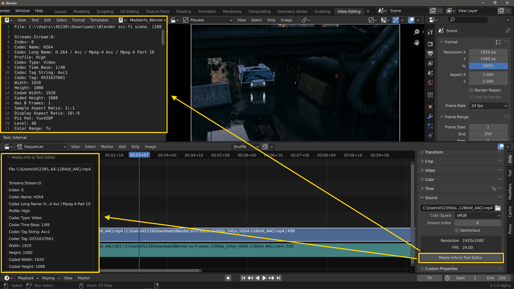

# Get Media Info 
In the Blender Video Seqeunce Editor, get Media Info for active strip and insert it into the Text Editor.

This python module is automatic installed with the add-on:
https://github.com/truethari/infomedia
On Windows, Blender needs to be run as Administrator when using the add-on the first time, or else will the module not be installed correctly.

